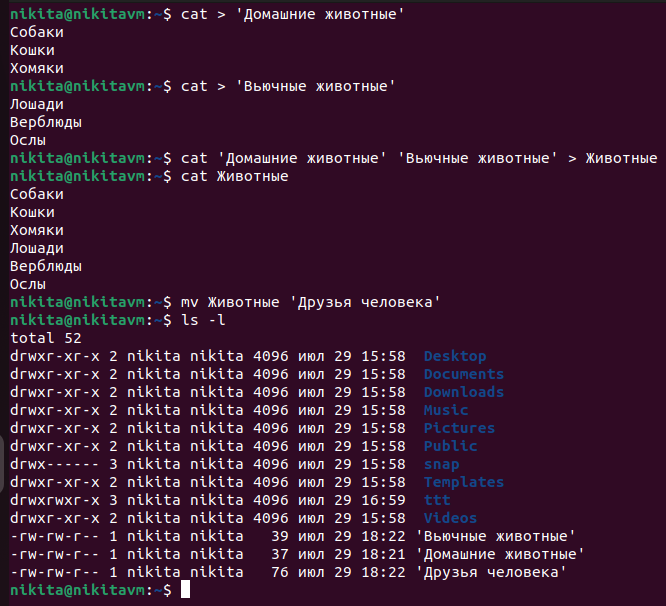
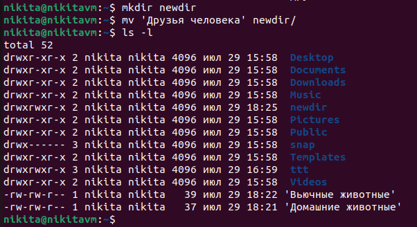
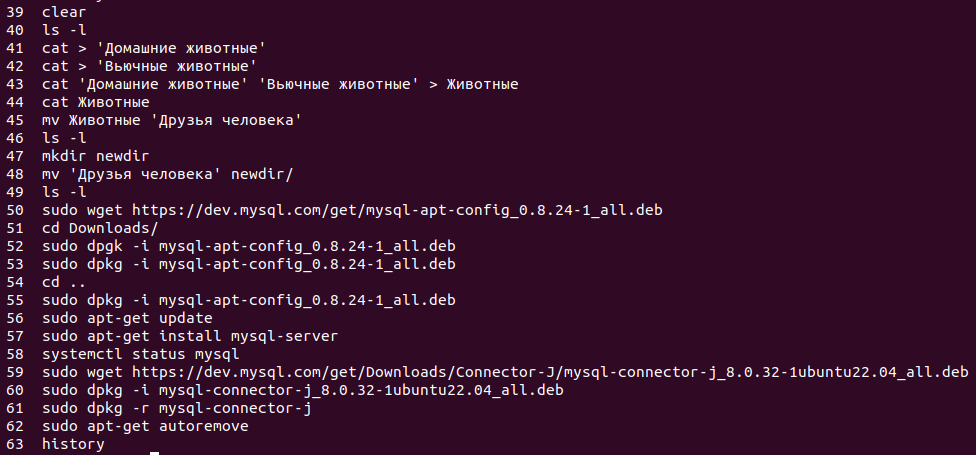
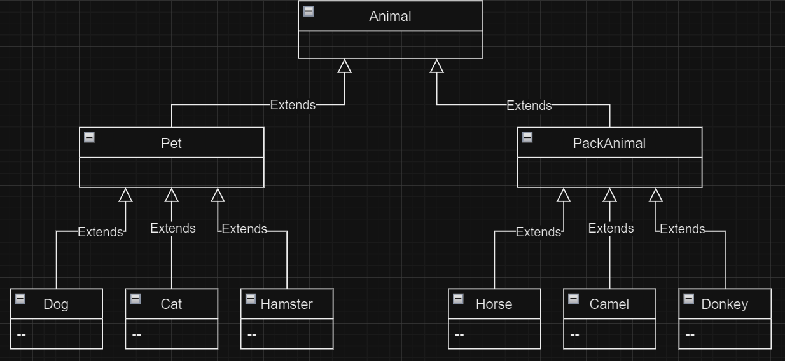

# `Итоговая контрольная работа`

## `Информация о проекте`

Необходимо организовать систему учета для питомника, в котором живут домашние и вьючные животные.

## `Задание:`

### 1. Используя команду cat, в терминале операционной системы Linux создать два файла Домашние животные (заполнив файл собаками, кошками, хомяками) и Вьючные животными (заполнив файл лошадьми, верблюдами и ослами), а затем объединить их. Просмотреть содержимое созданного файла. Переименовать файл, дав ему новое имя (Друзья человека).

Пишем в терминале следующие команды:

```bash
cat > 'Домашние животные'

Собаки
Кошки
Хомяки

cat > 'Вьючные животные'

Лошади
Верблюды
Ослы

cat 'Домашние животные' 'Вьючные животные' > Животные

cat Животные

mv Животные 'Друзья человека'

ls -l
```



### 2. Создать директорию, переместить файл туда.
```bash
mkdir newdir

mv 'Друзья человека' newdir/

ls -l 
```


### 3. Подключить дополнительный репозиторий MySQL. Установить любой пакет из этого репозитория.

Скачиваем конфигуратор mysql:

```bash
wget https://dev.mysql.com/get/mysql-apt-config_0.8.24-1_all.deb

sudo dpkg -i mysql-apt-config_0.8.24-1_all.deb
```
В процессе установки жмем Ок, чтобы выполнить полную установку

Обновляем информацию о пакетах и видим подключенный репозиторий mysql:

```bash
sudo apt-get update
```

Устанавливаем mysql-server:

```bash
sudo apt-get install mysql-server
```

Проверяем результат установки:

```bash
systemctl status mysql
```

### 4. Установить и удалить deb-пакет с помощью dpkg.

Скачиваем пакет для установки:

```bash
wget https://dev.mysql.com/get/Downloads/Connector-J/mysql-connector-j_8.0.32-1ubuntu22.04_all.deb
```

Устанавливаем пакет mysql-connector-j_8.0.32-1ubuntu22.04_all.deb:

```bash
sudo dpkg - i mysql-connector-j_8.0.32-1ubuntu22.04_all.deb
```
Удаляем пакет и его сопутствующие пакеты:

```bash
sudo dpkg -r mysql-connector-j

sudo apt-get autoremove
```

### 5. Выложить историю команд в терминале ubuntu.

Для получения истории введенных команд в терминале ubuntu используем:

```bash
history
```


### 6. Нарисовать диаграмму, в которой есть класс родительский класс, домашние животные и вьючные животные, в составы которых в случае домашних животных войдут классы: собаки, кошки, хомяки, а в класс вьючные животные войдут: лошади, верблюды и ослы).




### 7. В подключенном MySQL репозитории создать базу данных “Друзья человека”

```sql
DROP SCHEMA IF EXISTS peoplefriends;
CREATE DATABASE peoplefriends;
USE peoplefriends;
```

### 8. Создать таблицы с иерархией из диаграммы в БД

```sql
CREATE TABLE cat (
	id INT PRIMARY KEY AUTO_INCREMENT,
	animal_name CHAR(30),
    commands TEXT,
    date_of_birth DATE
);

CREATE TABLE dog (
	id INT PRIMARY KEY AUTO_INCREMENT,
	animal_name CHAR(30),
    commands TEXT,
    date_of_birth DATE
);

CREATE TABLE hamster (
	id INT PRIMARY KEY AUTO_INCREMENT,
	animal_name CHAR(30),
    commands TEXT,
    date_of_birth DATE
);

CREATE TABLE horse (
	id INT PRIMARY KEY AUTO_INCREMENT,
	animal_name CHAR(30),
    commands TEXT,
    date_of_birth DATE
);

CREATE TABLE camel (
	id INT PRIMARY KEY AUTO_INCREMENT,
	animal_name CHAR(30),
    commands TEXT,
    date_of_birth DATE
);

CREATE TABLE donkey (
	id INT PRIMARY KEY AUTO_INCREMENT,
	animal_name CHAR(30),
    commands TEXT,
    date_of_birth DATE
);
```

### 9. Заполнить низкоуровневые таблицы именами(животных), командами которые они выполняют и датами рождения

```sql
INSERT INTO cat (animal_name,commands, date_of_birth) VALUES 
	('barsik', 'meow', '2021-01-01'),
	('kosh', 'meow, stand', '2019-12-10'),
    ('frank', 'meow, wlow', '2020-02-02'),
    ('dir', 'meow', '2022-03-03'),
    ('krop', 'meow', '2018-05-05');
   
INSERT INTO dog (animal_name,commands, date_of_birth) VALUES 
	('wolf', 'flufy', '2021-01-01'),
	('ralf', 'site', '2019-12-10'),
    ('qwerty', 'left hand', '2020-02-02'),
    ('asdfg', 'right hand', '2022-03-03'),
    ('red', 'meow', '2018-05-05');
    
INSERT INTO hamster (animal_name,commands, date_of_birth) VALUES 
	('crack', 'eat', '2021-01-01'),
	('jisus', 'eat', '2019-12-10'),
    ('qwerty', 'left hand', '2020-02-02'),
    ('asdfg', 'right hand', '2022-03-03'),
    ('black', 'meow', '2018-05-05');
    
INSERT INTO horse (animal_name,commands, date_of_birth) VALUES 
	('igogo', 'eat', '2021-01-01'),
	('igaga', 'eat', '2019-12-10'),
    ('ijoho', 'left hand', '2020-02-02'),
    ('jijij', 'right hand', '2022-03-03'),
    ('aoaoaa', 'meow', '2018-05-05');
    
INSERT INTO camel (animal_name,commands, date_of_birth) VALUES 
	('qwea', 'eat', '2021-01-01'),
	('dsaf', 'eat', '2019-12-10'),
    ('gfdsdf', 'left hand', '2020-02-02'),
    ('grwtw', 'right hand', '2022-03-03'),
    ('werqr', 'meow', '2018-05-05');
    
INSERT INTO donkey (animal_name,commands, date_of_birth) VALUES 
	('stup', 'eat', '2021-01-01'),
	('tupi', 'eat', '2019-12-10'),
    ('upid', 'left hand', '2020-02-02'),
    ('task', 'right hand', '2022-03-03'),
    ('done', 'meow', '2018-05-05');
```
### 10. Удалив из таблицы верблюдов, т.к. верблюдов решили перевезти в другой питомник на зимовку. Объединить таблицы лошади, и ослы в одну таблицу.

```sql
TRUNCATE camel;

INSERT INTO horse (animal_name, commands, date_of_birth)
SELECT animal_name, commands, date_of_birth
FROM donkey;

DROP TABLE donkey;

RENAME TABLE horse TO horse_donkey;
```

### 11.Создать новую таблицу “молодые животные” в которую попадут все животные старше 1 года, но младше 3 лет и в отдельном столбце с точностью до месяца подсчитать возраст животных в новой таблице

```sql
CREATE TABLE young_animal (
	id INT PRIMARY KEY AUTO_INCREMENT,
	animal_name CHAR(30),
    commands TEXT,
    date_of_birth DATE,
    age TEXT
);


DELIMITER $$
CREATE FUNCTION age_animal (date_b DATE)
RETURNS TEXT
DETERMINISTIC
BEGIN
    DECLARE res TEXT DEFAULT '';
	SET res = CONCAT(
            TIMESTAMPDIFF(YEAR, date_b, CURDATE()),
            ' years ',
            TIMESTAMPDIFF(MONTH, date_b, CURDATE()) % 12,
            ' month'
        );
	RETURN res;
END $$
DELIMITER ;

INSERT INTO young_animal (animal_name, commands, date_of_birth, age)
SELECT animal_name, commands, date_of_birth, age_animal(date_of_birth)
FROM cat
WHERE TIMESTAMPDIFF(YEAR, date_of_birth, CURDATE()) BETWEEN 1 AND 2
UNION ALL
SELECT animal_name, commands, date_of_birth, age_animal(date_of_birth)
FROM dog
WHERE TIMESTAMPDIFF(YEAR, date_of_birth, CURDATE()) BETWEEN 1 AND 2
UNION ALL
SELECT animal_name, commands, date_of_birth, age_animal(date_of_birth)
FROM hamster
WHERE TIMESTAMPDIFF(YEAR, date_of_birth, CURDATE()) BETWEEN 1 AND 2
UNION ALL
SELECT animal_name, commands, date_of_birth, age_animal(date_of_birth)
FROM horse_donkey
WHERE TIMESTAMPDIFF(YEAR, date_of_birth, CURDATE()) BETWEEN 1 AND 2;

SET SQL_SAFE_UPDATES = 0;

DELETE FROM cat 
WHERE TIMESTAMPDIFF(YEAR, cat.date_of_birth, CURDATE()) IN (1, 2, 2);

DELETE FROM dog 
WHERE TIMESTAMPDIFF(YEAR, date_of_birth, CURDATE()) BETWEEN 1 AND 2;

DELETE FROM hamster 
WHERE TIMESTAMPDIFF(YEAR, date_of_birth, CURDATE()) BETWEEN 1 AND 2;

DELETE FROM horse_donkey 
WHERE TIMESTAMPDIFF(YEAR, date_of_birth, CURDATE()) BETWEEN 1 AND 2;
```

### 12. Объединить все таблицы в одну, при этом сохраняя поля, указывающие на прошлую принадлежность к старым таблицам

```sql
CREATE TABLE animals (
	id INT PRIMARY KEY AUTO_INCREMENT,
	animal_name CHAR(30),
    commands TEXT,
    date_of_birth DATE,
    age TEXT,
    animal_type ENUM('cat','dog','hamster', 'horse_donkey', 'young_animals') NOT NULL
);

INSERT INTO animals (animal_name, commands, date_of_birth, age, animal_type)
SELECT animal_name, commands, date_of_birth, age_animal(date_of_birth), 'cat'
FROM cat;

INSERT INTO animals (animal_name, commands, date_of_birth, age, animal_type)
SELECT animal_name, commands, date_of_birth, age_animal(date_of_birth), 'dog'
FROM dog;

INSERT INTO animals (animal_name, commands, date_of_birth, age, animal_type)
SELECT animal_name, commands, date_of_birth, age_animal(date_of_birth), 'hamster'
FROM hamster;

INSERT INTO animals (animal_name, commands, date_of_birth, age, animal_type)
SELECT animal_name, commands, date_of_birth, age_animal(date_of_birth), 'horse_donkey'
FROM horse_donkey;

INSERT INTO animals (animal_name, commands, date_of_birth, age, animal_type)
SELECT animal_name, commands, date_of_birth, age_animal(date_of_birth), 'young_animals'
FROM young_animal;
```

### 13-15 Программа в файле Main.java


