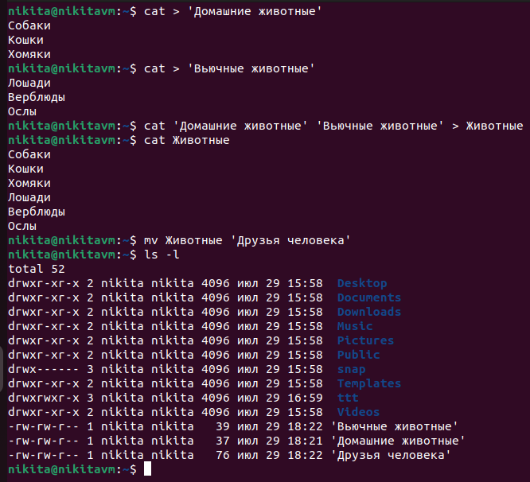
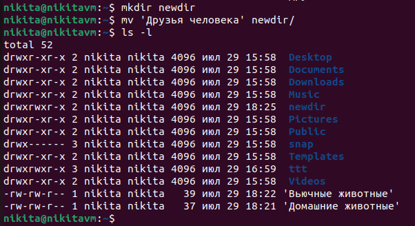
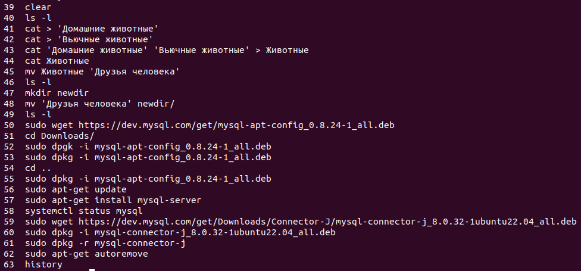

# `Итоговая контрольная работа`

## `Информация о проекте`

Необходимо организовать систему учета для питомника, в котором живут домашние и вьючные животные.

## `Задание:`

### 1. Используя команду cat, в терминале операционной системы Linux создать два файла Домашние животные (заполнив файл собаками, кошками, хомяками) и Вьючные животными (заполнив файл лошадьми, верблюдами и ослами), а затем объединить их. Просмотреть содержимое созданного файла. Переименовать файл, дав ему новое имя (Друзья человека).

Пишем в терминале следующие команды:

```bash
cat > 'Домашние животные'

Собаки
Кошки
Хомяки

cat > 'Вьючные животные'

Лошади
Верблюды
Ослы

cat 'Домашние животные' 'Вьючные животные' > Животные

cat Животные

mv Животные 'Друзья человека'

ls -l
```



### 2. Создать директорию, переместить файл туда.
```bash
mkdir newdir

mv 'Друзья человека' newdir/

ls -l 
```


### 3. Подключить дополнительный репозиторий MySQL. Установить любой пакет из этого репозитория.

Скачиваем конфигуратор mysql:

```bash
wget https://dev.mysql.com/get/mysql-apt-config_0.8.24-1_all.deb

sudo dpkg -i mysql-apt-config_0.8.24-1_all.deb
```
В процессе установки жмем Ок, чтобы выполнить полную установку

Обновляем информацию о пакетах и видим подключенный репозиторий mysql:

```bash
sudo apt-get update
```

Устанавливаем mysql-server:

```bash
sudo apt-get install mysql-server
```

Проверяем результат установки:

```bash
systemctl status mysql
```

### 4. Установить и удалить deb-пакет с помощью dpkg.

Скачиваем пакет для установки:

```bash
wget https://dev.mysql.com/get/Downloads/Connector-J/mysql-connector-j_8.0.32-1ubuntu22.04_all.deb
```

Устанавливаем пакет mysql-connector-j_8.0.32-1ubuntu22.04_all.deb:

```bash
sudo dpkg - i mysql-connector-j_8.0.32-1ubuntu22.04_all.deb
```
Удаляем пакет и его сопутствующие пакеты:

```bash
sudo dpkg -r mysql-connector-j

sudo apt-get autoremove
```

### 5. Выложить историю команд в терминале ubuntu.

Для получения истории введенных команд в терминале ubuntu используем:

```bash
history
```


### 6. Нарисовать диаграмму, в которой есть класс родительский класс, домашние животные и вьючные животные, в составы которых в случае домашних животных войдут классы: собаки, кошки, хомяки, а в класс вьючные животные войдут: лошади, верблюды и ослы).


